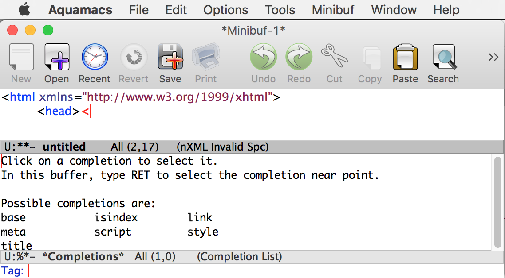

% Einführung in XML
% Heinz Wittenbrink
% 2019-03-26

# Plan

## Semester 2:

- General understanding of XML
- What do we have to know about XML?
- XML on the Web

## Semester 3:

- Component Content Management Systems
- Content Strategy and Enterprise Content Management

# "XML is 20"

---

## {data-background="http://gotocon.com/dl/2010/Web/JAOOForside_Pic/forside11.png" data-background-size="contain"}

<p class="rights">Source: [News Tim Bray](http://gotocon.com/aarhus-2010/newstimbray/1) </p>

---

> ... The first data format that anyone could pack anything up into, send across the network to anywhere, and unpack on the other end, without asking anyone’s permission or paying for software, or for the receiver to have to pay attention to what the producer thought they’d produced it for or what it meant.

Tim Bray: [XML is 20](https://www.xml.com/articles/2018/02/10/xml-20/)

---


> These days, nobody in their wildest dreams would consider designing a data format without also shipping open-source software to do something useful with it. But in 2008, it was pretty noteworthy that by February tenth, there were already several open-source parsers available off-the-shelf.

​Tim Bray: [XML is 20](https://www.xml.com/articles/2018/02/10/xml-20/)

---

> The second thing that mattered was the recognition that documents are data and deserve to be treated with respect, ... just like the rows and columns in spreadsheets and databases. Today, serious documents — medical records, the Legislation of the United States of America — live in XML and there’s really no other good choice.

Tim Bray: [XML is 20](https://www.xml.com/articles/2018/02/10/xml-20/)

---

> Now, the mirror image of that statement is that you can treat data records as documents. People did a lot of that with XML just because there was no other alternative…  and in fact we have done better, for weak values of “better”. I wonder if we’ll ever do better still? As the editor of the IETF JSON RFCs, I’m a pessimist.

Tim Bray: [XML is 20](https://www.xml.com/articles/2018/02/10/xml-20/)

---

[XML, JSON und YAML im Vergleich](https://www.predic8.de/xml-json-yaml.htm)

---

- General topic: Formats for structured information
- Alternatives: XML, HTML, JSON, YAML ... (and mixtures)
- In this course we will focus on the formats

---


# What is XML?

## XML-Basics
- XML: Extensible Markup Language
- Buidling on [SGML](https://www.w3.org/MarkUp/SGML/ "Overview of SGML Resources")
- Often understood as an alternative to HTML
- Syntax for XML-Vocabularies (Metalanguage)
- [W3C-Standard](https://www.w3.org/standards/xml/ "XML Technology - W3C")
- Basis für eine Familie von weiteren Standards und Technologien


## Specifications
- Most recent specification: [Extensible Markup Language (XML) 1.0 (Fifth Edition)](https://www.w3.org/TR/xml/ "Extensible Markup Language (XML) 1.0 (Fifth Edition)")[@paoli2008]
- Many other specifications


## Einsatzbereiche

- Publishing and management of documents: Structuring of the content and flexible representatiob
- Web-Services. Exchange format for the distributed processing of documents


## Dokumentorientierung und Datenorientierung

- Dokumentorientierung: Meist semistrukturierte Dokumente für menschliche Adressaten
- Datenorientierung: Hochstrukturierte Daten für eindeutige Weiterverarbeitung


## XML: Wichtige Eigenschaften und Begriffe
- Dokumente bestehen aus ineinander eingebetteten Elementen. Sie sind “Bäume” (Beispiel für Tree-View: [XML Online Parser and Viewer](http://countwordsfree.com/xmlviewer "XML Online Parser and Viewer"))
- Es gibt ein und nur ein hierarchisch oberstes Element, das Dokument- oder Wurzelelement.
- Elemente dürfen sich nicht überlappen.
- Die XML-Syntax ist die Serialisierung einer Hierarchie.
- Attribute müssen einen Wert haben. Sie stehen gleichgeordnet bei einem Element.

## Valides XML
- Valides XML entspricht den Regeln eines Dokumenttyps oder XML-Vokabulars
- Praktisch verwendete XML-Dokumente gehören fast immer zu einem Vokabular
- Validierung ist die formale Überprüfung der Regelkonformität eines Dokuments
- Dokumenttypen können formal u.a. in Dokumenttyp-Definitionen (DTDs) oder durch XML- bzw. Relax NG-Schemas definiert werden
- Beispiel: [Relax NG-Schemas für HTML5](http://syntax.whattf.org/ "syntax.whattf.org")

## XML-Verarbeitung
- Bei der XML-Verarbeitung entnimmt ein Parser dem Dokument die relevanten Informationen
- Dieser Prozess ist standardisiert, wobei es unterschiedliche Parser gibt
XML-Parser stellen die Verarbeitung ein, sobald ein Dokument nicht wohlgeformt ist
- Wichtige Form der Verarbeitung: Transformation mit XSLT (Beispiel: [Free Online XSL Transformer (XSLT)](http://www.freeformatter.com/xsl-transformer.html "Free Online XSL Transformer (XSLT) - FreeFormatter.com"))

## Unterschiede XML und HTML
- XML is case-sensitive, HTML not
- XML-Elemente müssen geschlossen sein, HTML-Elemente nicht
- XML-Attribute müssen einen Namen und einen Wert haben
- Die Dokumenttyp-Deklaration unterscheidet sich, siehe https://www.w3.org/QA/2002/04/valid-dtd-list.html
- HTML-Parser sind toleranter als XML-Parser


## XML-Vokabulare im Web
- XHTML und (https://www.w3.org/TR/xhtml1/ und https://www.w3.org/TR/xhtml11/)
Scalable Vector Graphics SVG (https://www.w3.org/Graphics/SVG/)
- MathML (https://www.w3.org/Math/)
- RSS (https://validator.w3.org/feed/docs/rss2.html) und Atom (https://validator.w3.org/feed/docs/atom.html)
- XML-Sitemaps
- Epub (http://idpf.org/epub)


## Beispiel: SVG

{width=50%}


## SVG-Quelltext:

```XML
<?xml version="1.0" encoding="utf-8" ?>
<!DOCTYPE svg PUBLIC "-//W3C//DTD SVG 1.1//EN"
 "http://www.w3.org/Graphics/SVG/1.1/DTD/svg11.dtd">  
<svg width="400" height="400" xmlns="http://www.w3.org/2000/svg" >
 <title>SVG</title>
 <style type="text/css"><![CDATA[
  text {font-size:60px; text-anchor:middle;}
 ]]></style>
 <rect x="0" y="0" height="400" width="400" fill="white" stroke="blue" stroke-width="100" />
 <rect x="160" y="80" width="80" height="240" fill="red" />
 <rect x="80" y="160" width="240" height="80" fill="red" />
 <text x="200" y="220">Arzt</text>
</svg>
```

## XML vocabularies for structures documentation
- DocBook (<http://www.docbook.org/>) und DITA (<http://dita.xml.org/>) sind  wichtige Formate für das Single Source Publishing
- DocBook wurde als buchorientierter Dokumenttyp entwickelt
- DITA ist eine Topic-orientierte Alternative, die sich am Prinzip des didaktischen Minimalismus orientiert

## XML for office documents
- Microsoft Office und Libre Office/Open Office verwenden XML als natives Format
- Office Open XML ist ein (umstrittener) ECMA-Standard (<http://www.ecma-international.org/publications/standards/Ecma-376.htm>)
- Das Open Document Format (<https://www.oasis-open.org/committees/tc_home.php?wg_abbrev=office>) ist XML basiert und ein OASIS-Standard
- Libre Office unterstützt auch DocBook

## History of markup languages
- Basis: SGML, bereits seit den 1960er Jahren entwickelt
- HTML wurde als SGML-Anwendung entwickelt
- XML entstand in den 1990er Jahren als Alternative zu HTML und vereinfachte Version von SGML
- HTML5 setzte sich gegen XHTML als lebender HTML-Standard durch.
- Parallel etablierte sich JSON als einfaches Format für den Datenaustausch im Web

## Transformation and presentation of XML
- XML erlaubt eine strikte Trennung von Inhalt und Präsentation
- XML-Dokumente werden meist mit XSLT in andere XML-Vokabulare oder HTML überführt
- XSLT ist eine funktionale Programmiersprache, die die XML-Syntax verwendet
Für die seitenorientierte Ausgabe wurde XSL-FO entwickelt

## Microdata
- Als Microdata können maschinenlesbare Informationen in HTML-Dokmente eingebettet werden (https://www.w3.org/TR/microdata/)
- RFFa und Jason sind Alternativen
- Microformats haben eine ähnliche Zielsetzung, basieren aber auf älteren HTML-Mechanismem
- Empfehlenswert ist die Orientierung an Schema.org

## RDF/RDFa
- RDF ist ein Standard für semantische Informationen im Web
- RDF kann als XML, aber auch in anderen Formaten serialisiert werden
- RDF wurde als Basistechnologie für das Semantic Web entwickelt
- Mit RDFa können RDF-Daten in HTML-Dokumente eingebettet werden
- Das von Facebook entwickelte Open Graph Protocol (http://ogp.me/) basiert auf RDFa

## Ressources
- [Extensible Markup Language (XML)](https://www.w3.org/XML/ "Extensible Markup Language (XML)")
- [XML.com](https://www.xml.com/ "XML.com")
- [data2type GmbH: XML-Technologien | Nachschlagewerk](https://www.data2type.de/xml-xslt-xslfo/ "data2type GmbH: XML-Technologien | Nachschlagewerk")
- [xml \@ZVON.org](http://zvon.org/comp/m/xml.html "xml @ZVON.org")

# XML syntax

## XML syntax
- Spitzklammern unterscheiden Markup und Textinhalt
- Wichtigste syntaktische Features: Elemente, Attribute, Kommentare
- Wohlgeformtes XML folgt syntaktischen Regeln: Elemente sind geschlossen und ineinander eingebettet, Attribute haben Werte in Anführungsstrichen, Groß und Kleinschreibung sind bedeutungsunterscheidend
- Valides XML entspricht einem definierten Dokumenttyp

## Example of an XML document

```xml
<?xml version="1.0"?>
<!-- dictionary.xml
 - Copyright (c) 2014, HerongYang.com, All Rights Reserved.
-->
<dictionary>
 <word acronym="true">
  <name>XML</name>
  <definition reference="Herong&apos;s Notes">eXtensible Markup
Language.</definition>
  <update date="2002-12-23"/>
 </word>
 <word symbol="true">
  <name>&lt;</name>
  <definition>Mathematical symbol representing the "less than" logical
operation, like: 1&lt;2.</definition>
  <definition>Reserved symbol in XML to representing the beginning of
tags, like: <![CDATA[<p>Hello world!</p>]]>
  </definition>
</word>
</dictionary>
```

## XML-Deklaration


```xml
<?xml version="1.0" encoding="UTF-8" standalone="yes"?>
```

- Steht am Beginn eines Dokuments, gibt die XML-Version an.
- Optional: Angabe des Encoding (der Zeichenkodierung)
- Optional: Angabe der Referenzierung einer externen Dokumenttyp-Deklaration (DTD)

## Comments

```xml
<!-- dictionary.xml
 - Copyright (c) 2014, HerongYang.com, All Rights Reserved.
-->
```

- Enthalten Botschaften für menschliche Nutzer
- Werden von der XML verarbeitenden Software nicht verwendet


## Dokument element or root elelement

```xml
<dictionary>
.
.
.
</dictionary>
```

- Jedes XML-Dokument hat ein und nur ein Wurzelelement
- Ohne Wurzelelement könnte keine Baumstruktur aufgebaut werden

## Element with attribute

```xml
<word acronym="true">
.
.
.
</word>
```

- Elemente und Attribute sind die wichtigsten syntaktischen Bestandteile von XML-Dokumenten
- Elemente können einen Inhalt haben, Attribute haben einen *Wert*
- Bei Elementen ist die Reihenfolge relevant, bei Attributen nicht


## Elements

```xml
<name>XML</name>
.
.
.
<update date="2002-12-23"/>
```

- Start und End-Tag
- Elementnamen
- Leere Elememente

## Attributes

```xml
<update date="2002-12-23"/>
```

- Attribute names and attribute values
- Values must always be in quotation markes
- Order of the elements is not relevant

## Leeres Elemente

```xml
<update date="2002-12-23"/>
```

- Abbreviated Syntax: Slash before the closing bracket

## Entities

```xml
Herong&apos;s Notes">...

..., like: 1&lt;2

```

- For special characters
- For the escaping of characters which would be parsed as markup otherwise


## CDATA sections

```xml
<definition>Reserved symbol in XML to representing the beginning of
tags, like: <![CDATA[<p>Hello world!</p>]]>
  </definition>
```

- For sections with must not be parsed as markup
- Exampe: HTML in RSS documents


## Further Examples


- [A List Apart: Using XML : Sample XML Document](https://alistapart.com/d/usingxml/xml_uses_a.html "A List Apart: Using XML : Sample XML Document")

- [Sample XML File (books.xml)](https://msdn.microsoft.com/en-us/library/ms762271(v=vs.85) "Sample XML File (books.xml)")


# Editing XML as text

## Text editors

Online: [Online XML Editor](https://www.tutorialspoint.com/online_xml_editor.htm "Online XML Editor")

## Encoding

- Representation of characters by bits and bytes
- ASCII and friends: 1 character - 1 bit
- Unicode: 1 nuber per every Character in in every writing system
- Unicode Encodings: Translation of these numbers into bytes


## Syntax Highlighting

## Validating Editors
{ width=80% }

(Befehl: `C-M-i`)


## Online Tools

[W3C XML Schema (XSD) Validation online](http://www.utilities-online.info/xsdvalidation/#.WenM6hN-qRs "W3C XML Schema (XSD) Validation online")

[Free Online XML Validator (RelaxNG)](https://www.liquid-technologies.com/online-relaxng-validator "Free Online XML Validator (RelaxNG)")

[XSLT (eXtensible Stylesheet Language Transformations) online transformations](http://www.utilities-online.info/xsltransformation/#.WenPLRN-qRs "XSLT (eXtensible Stylesheet Language Transformations) online transformations")


# Material

## XML

- [XML – SELFHTML-Wiki](http://wiki.selfhtml.org/wiki/XML)
- [A Gentle Introduction to XML - The TEI Guidelines](http://www.tei-c.org/release/doc/tei-p5-doc/de/html/SG.html)
- [XML - Grundlagen - TEIA AG](https://www.teialehrbuch.de/Kostenlose-Kurse/XML-Grundlagen/)
- [XML.com](https://www.xml.com/)

## XHTML/XML Syntax for HTML

- [HTML/Unterschiede von HTML zu XHTML – SELFHTML-Wiki](https://wiki.selfhtml.org/wiki/HTML/Unterschiede_von_HTML_zu_XHTML)
- [HTML Standard](https://html.spec.whatwg.org/multipage/xhtml.html)

## RDFa

- [RDFa - Wikipedia](https://en.wikipedia.org/wiki/RDFa)
- [RDFa 1.1 Primer - Third Edition](https://www.w3.org/TR/rdfa-primer/)

## SVG

- [Introduction - SVG: Scalable Vector Graphics | MDN](https://developer.mozilla.org/en-US/docs/Web/SVG/Tutorial/Introduction)
- [SVG Tutorial - SVG: Scalable Vector Graphics | MDN](https://developer.mozilla.org/en-US/docs/Web/SVG/Tutorial)

## RSS

- [RSS Readers Are Due for a Comeback: Feedly, The Old Reader, Inoreader | WIRED](https://www.wired.com/story/rss-readers-feedly-inoreader-old-reader/)
- [data2type GmbH: XML-Technologien | Newsfeeds mit RSS und Atom](https://www.data2type.de/xml-xslt-xslfo/newsfeeds-rss-atom/)

## AIML

- [About Pandorabots · Pandorabots Documentation](https://pandorabots.com/docs/)
- [Build a Simple Virtual Assistant with AIML 2.0 - Google Slides](https://docs.google.com/presentation/d/1H-FlxdbgBLLtUvCBcXsWVrIV5baWzMVvuNw2mww0LI4/edit#slide=id.p)

## Literatur
